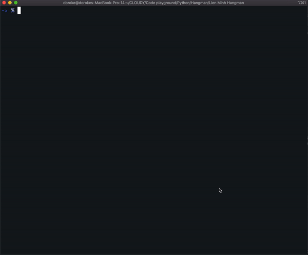

<h1 align="left">Liên Minh Hangman</h1>

<!-- 
(English below)
 -->

<h2>Tiếng Việt</h2>

Đây là game Hangman phiên bản Liên Minh Huyền Thoại đã bao gồm tên chiêu thức được Việt hóa. Các bạn sẽ đoán tên tướng dựa trên tên 1 kĩ năng của tướng đó.

Khác với phiên bản Hangman tiếng Anh mình đã build trước đó thì đã có sẵn API, xây dựng phiên bản tiếng Việt cực hơn 1 chút khi mình phải crawl data từ trang chủ của Garena vì Riot đã ngừng cung cấp API cho server Đông Nam Á. Một số tên kĩ năng vẫn còn bị lỗi do kết quả API trả về bị sai. Phiên bản này mình cập nhật thêm nội tại cho tất cả các tướng.

<!-- 

 -->

<h3>Làm thế nào để chơi?</h3>

Bạn không cần phải cài thêm bất kì một thư viện nào để chơi. Nếu bạn đã có sẵn Python trong máy, bạn chỉ cần mở terminal lên và nhập:
 

<code>python3 LienMinhHangman.py</code>

<h3>Làm sao update kĩ năng tướng mới?</h3>

Hiện tại ở phiên bản 11.11 đang có 155 tướng. Khi bạn muốn update tướng mới, bạn cần chạy file <code>get_data_v2.py</code> để cập nhật tướng. File này sẽ xuất ra 1 file data <code>lienminh.json</code> mới.
 

<h4>tl;dr</h4>

This is the Vietnamese edition for League of Hangman.
